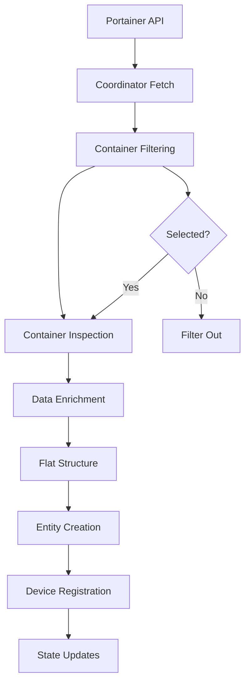

# Portainer Integration: Container Entity Creation Process

## Overview

This document describes the complete process of how container entities are created in the Portainer Home Assistant integration, from API data fetching to final entity registration.

## Architecture Overview

```
┌─────────────────┐    ┌──────────────────┐    ┌─────────────────┐
│   Portainer     │    │   Home Assistant │    │   Device        │
│   API           │    │   Integration    │    │   Registry      │
└─────────────────┘    └──────────────────┘    └─────────────────┘
         │                       │                       │
         │ 1. Fetch containers    │                       │
         │ from all endpoints     │                       │
         │                       │                       │
         │<───────────────────────│                       │
         │                       │                       │
         │ 2. Process & filter    │                       │
         │ containers             │                       │
         │                       │                       │
         │───────────────────────>│ 3. Create entities    │
         │                       │                       │
         │                       │───────────────────────>│
         │                       │                       │
         │                       │ 4. Register devices   │
         │                       │                       │
         │                       │<───────────────────────│
         │                       │                       │
         │                       │ 5. Update states      │
         │                       │                       │
```

## Detailed Process Flow

### 1. Container Data Fetching

**Location**: `coordinator.py`, `get_containers()` method

**Process**:
1. Iterate through all configured endpoints
2. For each endpoint, call Portainer API: `endpoints/{eid}/docker/containers/json?all=1`
3. Parse API response using `parse_api()` with container field definitions
4. Extract container names from Docker `Names` array (format: `["/container-name"]`)

**Key Data Extracted**:
```python
{
    "Id": "container_id",
    "Names": ["/container-name"],
    "Image": "image:tag",
    "State": "running|stopped|exited",
    "Ports": [...],
    "Labels": {
        "com.docker.compose.project": "stack_name",
        "com.docker.compose.service": "service_name"
    }
}
```

**Container Name Processing**:
```python
# Extract name from Docker Names array
if container["Names"] and len(container["Names"][0]) > 1:
    container["Name"] = container["Names"][0][1:]  # Remove leading slash
else:
    container["Name"] = f"container_{container_id}"  # Fallback
```

### 2. Container Filtering and Selection

**Location**: `coordinator.py`, container processing loop

**Selection Storage**:
```python
self.selected_containers = {
    "config_name_endpoint_id_container_name",
    "config_name_endpoint_id_container_name2"
}
```

**Filtering Logic**:
```python
container_key = f"{config_entry_id}_{endpoint_id}_{container_name}"
config_name_key = f"{config_name}_{endpoint_id}_{container_name}"

# Check both formats for backward compatibility
if container_key in selected_containers or config_name_key in selected_containers:
    # Process container
    pass
else:
    # Filter out container
    del all_containers[cid]
```

**Supported Formats**:
- **Config Entry ID Format**: `01K7HFNR3527W6HYGM6SFGDTG1_2_container_name`
- **Config Name Format**: `Portainer_2_container_name` (backward compatibility)

### 3. Container Inspection and Data Enrichment

**Location**: `coordinator.py`, after filtering

**Process**:
1. For each selected container, fetch detailed inspection data:
   ```bash
   GET /api/endpoints/{eid}/docker/containers/{cid}/json
   ```

2. Extract additional data:
   - Network configuration and IP addresses
   - Mount points and volumes
   - Health check status (if enabled)
   - Restart policies (if enabled)
   - Resource usage statistics

**Error Handling**:
- If inspection fails, container is skipped with warning
- If data format is invalid, container is filtered out

### 4. Data Structure Transformation

**Location**: `coordinator.py`, end of `get_containers()`

**Process**:
1. Convert endpoint-based structure to flat container structure:
   ```python
   # Before: raw_data["containers"][endpoint_id][container_id]
   # After:  raw_data["containers"][container_key] = container_data
   ```

2. Create unique keys for each container:
   ```python
   key = f"{config_entry_id}_{endpoint_id}_{container_name}"
   flat_containers[key] = container_data
   ```

### 5. Entity Creation

**Location**: `entity.py`, `async_create_sensors()`

**Process**:
1. Iterate through all containers in coordinator data
2. For each container, check if it should be included:
   ```python
   device_identifier = f"{config_entry_id}_{endpoint_id}_{container_name}"
   config_name_identifier = f"{config_name}_{endpoint_id}_{container_name}"

   if device_identifier in selected_containers or config_name_identifier in selected_containers:
       # Create entity
   ```

3. Create `ContainerSensor` entities for each valid container

### 6. Device Registration

**Location**: `sensor.py`, `ContainerSensor.device_info`

**Device Identifiers**:
```python
{
    "identifiers": {
        (DOMAIN, f"{config_entry_id}_{endpoint_id}_{container_name}")
    },
    "name": container_name,
    "manufacturer": "Portainer",
    "model": "Container",
    "via_device": (DOMAIN, f"{endpoint_id}_{config_entry_id}")
}
```

**Device Creation**:
- Devices are created automatically when entities are first loaded
- Device registry ensures uniqueness across config entries
- Parent-child relationships established with endpoint devices

## Configuration Flow Integration

### Container Selection UI

**Location**: `config_flow.py`, `async_step_select_items()`

**Process**:
1. Fetch available containers from all selected endpoints
2. Present selection UI with format: `container_name [status]`
3. Store selections using config name format: `config_name_endpoint_id_container_name`

### Options Flow Updates

**Location**: `config_flow.py`, `PortainerOptionsFlow`

**Process**:
1. Allow updating container selections after initial setup
2. Handle device cleanup when containers are deselected
3. Maintain backward compatibility with existing configurations

## Common Issues and Troubleshooting

### Issue 1: Containers Not Appearing

**Symptoms**:
- Containers selected in config but no entities created
- "Final container results" log shows empty

**Causes**:
1. **Format Mismatch**: Selected containers use different format than coordinator expects
2. **API Failures**: Container inspection requests failing
3. **Name Extraction**: Container names not properly extracted from Docker API

**Debugging**:
```bash
# Check selected containers
Selected containers for [name]: {set_of_selected}

# Check container processing
Processing container: [name] (CID: [id])
Checking container [name]: key=[key], selected=[selected], in_selected=[true/false]

# Check final results
Final container results for [entry_id]:
  Container: [name] (Stack: [stack], State: [state])
```

### Issue 2: Wrong Containers Selected

**Symptoms**:
- Different containers appear than expected
- Container names don't match Portainer UI

**Causes**:
1. **Name Processing**: Docker API returns names in different format
2. **Multiple Containers**: Same name on different endpoints
3. **Configuration Issues**: Selected containers not properly saved

### Issue 3: Device Creation Failures

**Symptoms**:
- Entities exist but no devices in registry
- Device relationships broken

**Causes**:
1. **Timing Issues**: Devices created before endpoints
2. **Identifier Conflicts**: Duplicate identifiers across config entries
3. **Registry Issues**: Device registry corruption

## Data Flow Summary



## Key Components

### Coordinator (`coordinator.py`)
- **Primary Responsibility**: Data fetching and processing
- **Key Methods**: `get_containers()`, `_async_update_data()`
- **Data Storage**: `self.raw_data["containers"]`

### Entity Creation (`entity.py`)
- **Primary Responsibility**: Entity instantiation and filtering
- **Key Methods**: `async_create_sensors()`
- **Filtering Logic**: Container selection validation

### Sensor Platform (`sensor.py`)
- **Primary Responsibility**: Entity and device creation
- **Key Classes**: `ContainerSensor`
- **Device Info**: Device registry integration

### Config Flow (`config_flow.py`)
- **Primary Responsibility**: User configuration and selection
- **Key Methods**: `async_step_select_items()`
- **Data Storage**: `config_entry.options["containers"]`

## Performance Considerations

### API Rate Limiting
- Container inspection requests are made sequentially
- Large numbers of containers may impact update frequency
- Consider enabling only necessary containers

### Memory Usage
- All container data stored in coordinator memory
- Flat structure prevents deep nesting
- Consider memory impact for many containers

### Update Frequency
- Default scan interval: 30 seconds
- Each update fetches all containers and inspects each
- Network timeouts may cause update failures

## Best Practices

1. **Container Selection**: Only select containers you need to monitor
2. **Error Handling**: Monitor logs for API failures and timeouts
3. **Format Consistency**: Use consistent naming across environments
4. **Debug Logging**: Enable debug logging when troubleshooting issues

## Testing

The integration includes comprehensive tests for:
- Container data parsing and processing
- Entity creation and device registration
- Configuration flow and option updates
- Error handling and edge cases

Run tests with:
```bash
pytest tests/unit/test_api.py -v
pytest tests/unit/test_coordinator.py -v
pytest tests/unit/test_entity.py -v